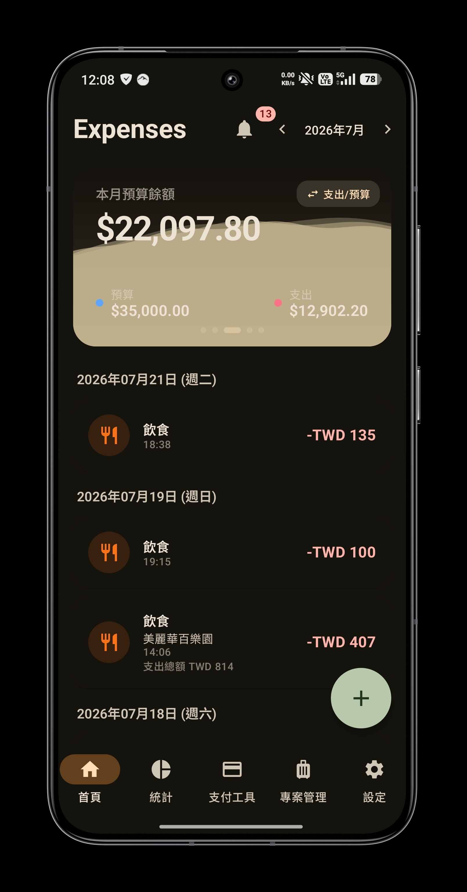
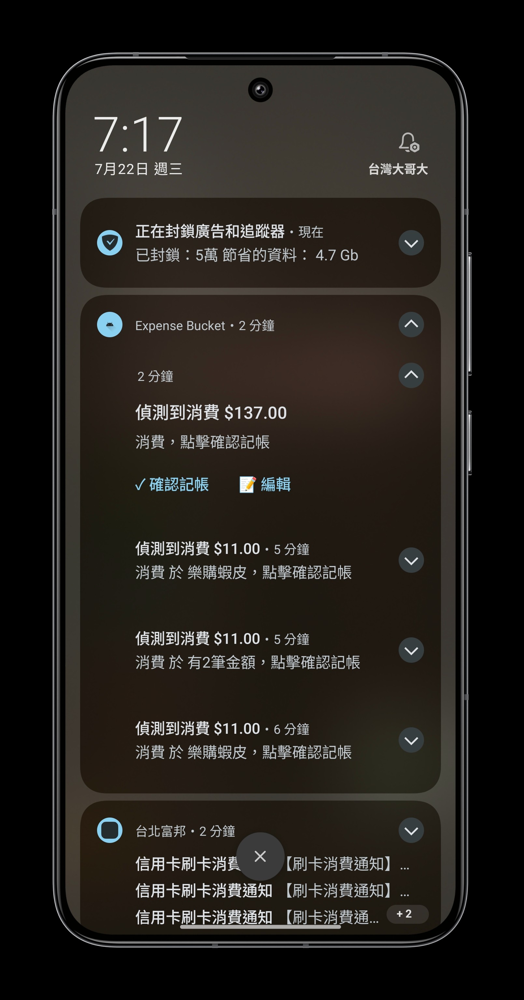
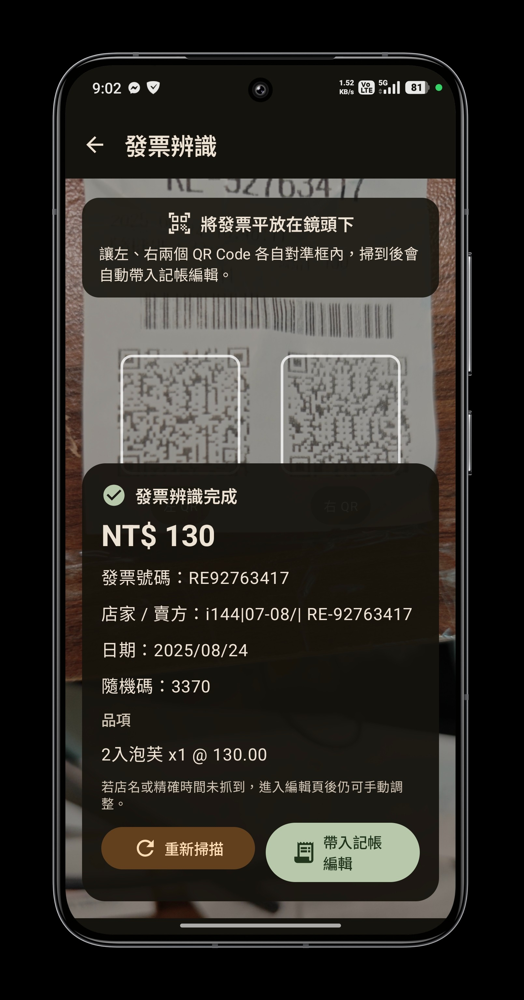
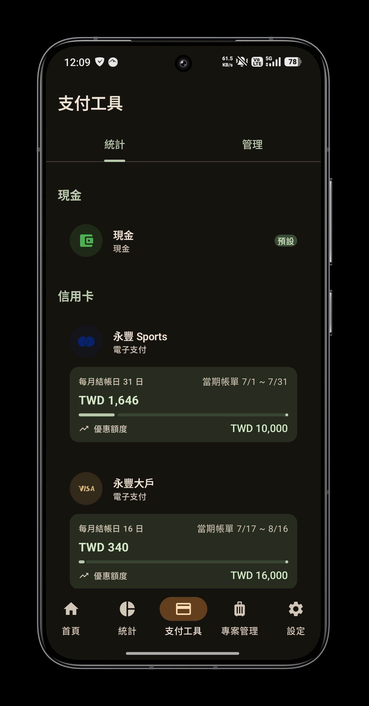
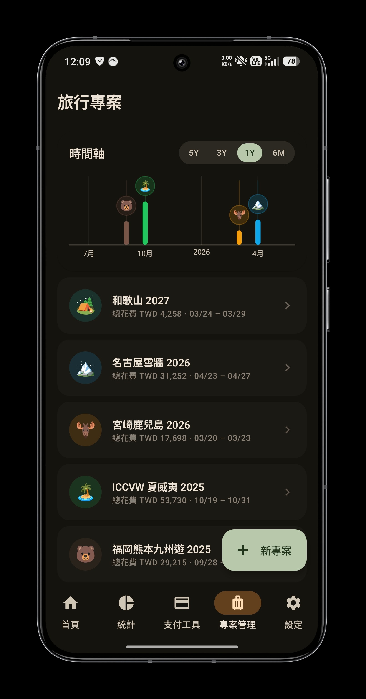
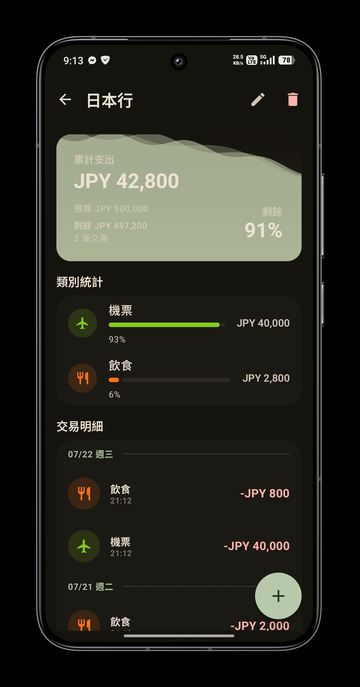
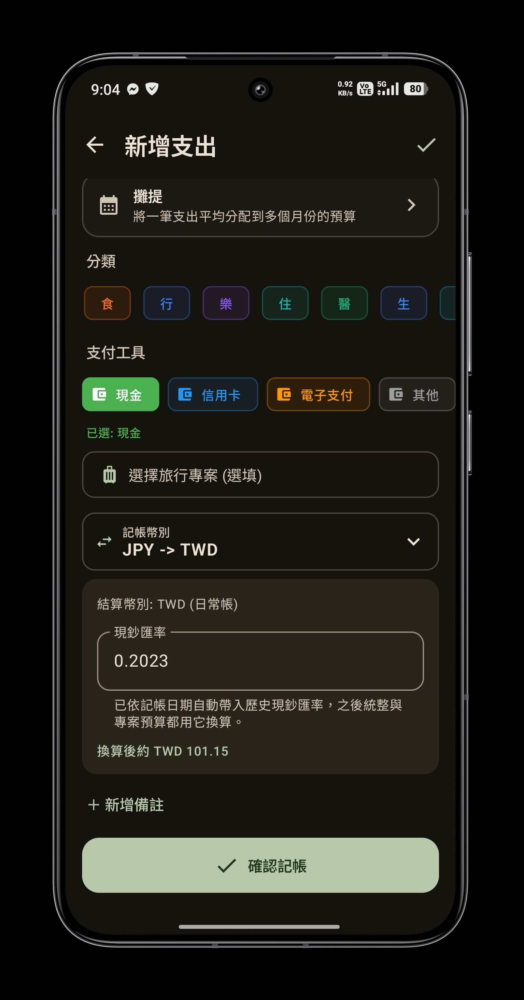
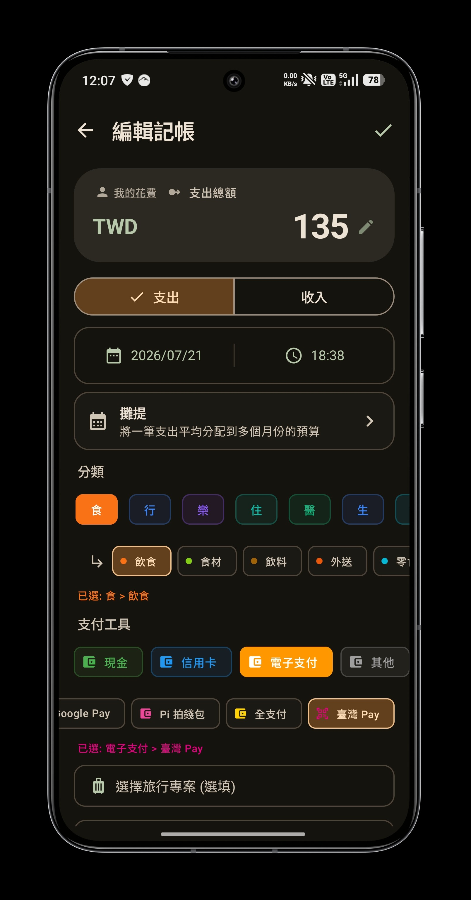
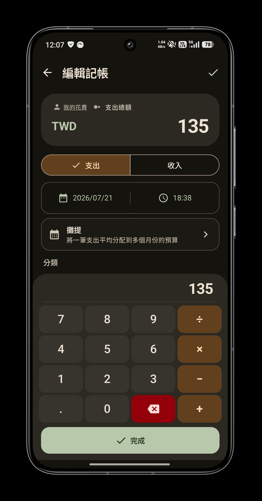

<div align="center">
  

  # Expense Bucket

  An experimental Android expense tracker for everyday spending and travel.

  
  
  
  
</div>

## Overview

Expense Bucket reduces manual data entry while keeping every transaction under user control. It can detect expenses from Android notifications, scan Taiwan e-invoice QR codes, track card benefit limits, convert foreign-currency transactions, and separate travel spending into projects.

## Features

| Area | Capabilities |
| --- | --- |
| Transaction capture | Detect expense notifications, review drafts, scan e-invoice QR codes, and edit extracted details before saving. |
| Budget tracking | Display monthly and project budgets as a dynamic water level; the level falls as spending increases. |
| Credit cards | Calculate spending by each card's billing cycle and track usage against its monthly benefit limit. |
| Multi-currency | Record an original currency, apply the historical cash exchange rate for the transaction date, and convert it to the account currency. |
| Travel projects | Keep a separate budget, category breakdown, timeline, and transaction history for each trip. |
| Transaction details | Organize entries by category, subcategory, payment method, project, notes, and multi-month allocation. |
| Utilities | Use the built-in calculator for amounts and review spending through summary statistics. |

## Screenshots

<table>
  <tr>
    <td align="center" width="33%">
      <br>
      <strong>Monthly overview</strong><br>
      <sub>Remaining budget, spending, and transaction history</sub>
    </td>
    <td align="center" width="33%">
      <br>
      <strong>Notification capture</strong><br>
      <sub>Detected expenses remain editable before confirmation</sub>
    </td>
    <td align="center" width="33%">
      <br>
      <strong>Invoice scanning</strong><br>
      <sub>Amount, invoice metadata, and line items from QR codes</sub>
    </td>
  </tr>
  <tr>
    <td align="center" width="33%">
      <br>
      <strong>Card usage</strong><br>
      <sub>Billing-cycle totals and benefit-limit progress</sub>
    </td>
    <td align="center" width="33%">
      <br>
      <strong>Project timeline</strong><br>
      <sub>Trip dates and total spending in one view</sub>
    </td>
    <td align="center" width="33%">
      <br>
      <strong>Project details</strong><br>
      <sub>Independent budget, categories, and transactions</sub>
    </td>
  </tr>
  <tr>
    <td align="center" width="33%">
      <br>
      <strong>Multi-currency entry</strong><br>
      <sub>Historical exchange rate and account-currency estimate</sub>
    </td>
    <td align="center" width="33%">
      <br>
      <strong>Transaction editor</strong><br>
      <sub>Categories, payment methods, projects, and allocation</sub>
    </td>
    <td align="center" width="33%">
      <br>
      <strong>Amount calculator</strong><br>
      <sub>Basic calculations without leaving the entry flow</sub>
    </td>
  </tr>
</table>

## Technology

- Kotlin and Jetpack Compose with Material 3
- Room for local persistence
- Hilt for dependency injection
- DataStore for application preferences
- CameraX and Google ML Kit for document, barcode, and text recognition
- Kotlin Coroutines for asynchronous work

## Requirements

- Android Studio with JDK 17
- Android SDK 36
- Android 8.0 (API 26) or later for installation

## Build

Clone the repository, open it in Android Studio, or run the following command from the project root:

```powershell
./gradlew.bat :app:assembleDebug
```

The debug APK is generated under `app/build/outputs/apk/debug/`.

Useful verification commands:

```powershell
./gradlew.bat :app:compileDebugKotlin
./gradlew.bat :app:testDebugUnitTest
```

If Gradle cannot find Java, set `JAVA_HOME` to the JBR bundled with Android Studio.

## Project status

Expense Bucket is an experimental personal project. Interfaces, data models, and behavior may change without backward-compatibility guarantees.

## AI-assisted development

This project is also an experiment in building an Android application through agentic AI-assisted development. Google Antigravity was used during the early stages, followed by Codex. Models that contributed include:

- GPT-5.5
- GPT-5.4
- Claude Opus 4.6
- Claude Sonnet 4.6
- Gemini 3.1 Pro
